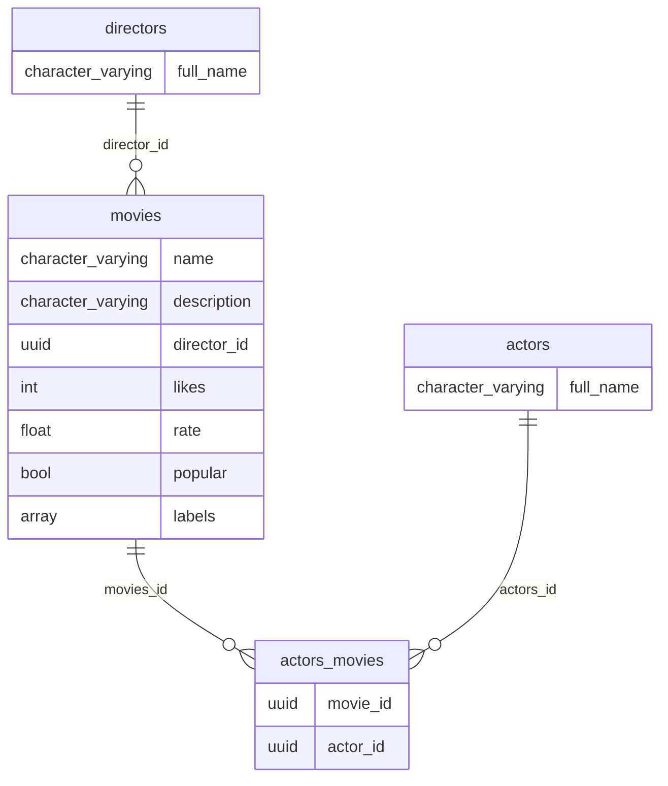

# Imdb

Simple API to test relationships, tests and some libraries

## Model



## Cleaning code

```shell
mix setup
mix test

mix format # format code
mix credo # like rubocop
mix coverall.html # code coverage
mix deps.audit # libraries vulnerabilities check
mix sobelow # security static code check

mix phx.server
open http://localhost:4000/api/movies
```

## Routes

```shell
# simplified routes
mix phx.routes | grep '/api' | awk '{print $2 " " $3}' | sed '/.*Controller/d'

# seed some data
mix run priv/repo/seeds.exs

# Example filtering movies
curl http://localhost:4000/api/movies | jq . # all
curl http://localhost:4000/api/movies?name=monkeys | jq .
curl http://localhost:4000/api/movies\?description=first&min_likes=0&min_rate=0 | jq .
```
